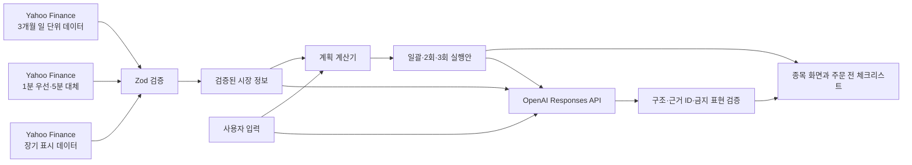

# Action Planner

> 초보 투자자가 종목을 고른 뒤 마주치는 “어떻게 사고팔지?”를 공개 시장 데이터, 사용자의 걱정, 검증 가능한 계산으로 함께 정리하는 매매 의사결정 동반자입니다.

[배포된 데모 열기](https://kpsec-action-planner.vercel.app) · 해커톤 프로토타입 · 실제 주문 없음

## 프로젝트 한눈에 보기

| 항목 | 내용 |
| --- | --- |
| 문제 | 초보 투자자는 종목을 정한 뒤에도 한 번에 거래할지, 나누어 거래할지, 언제 계획을 다시 확인할지 판단하기 어렵습니다. |
| 대상 | 매수·매도 의도는 있지만 실행 방법과 중단 조건을 정하지 못한 초보 투자자 |
| 해결 방식 | Yahoo Finance 공개 데이터와 사용자 입력을 분리해 검증하고, 계획 계산기가 실행안을 만든 뒤 AI가 차이와 반대 의견을 쉬운 말로 설명합니다. |
| 핵심 아이디어 | 놓칠까 봐 걱정되는 정도와 거래 직후 가격이 움직일 때의 부담을 `후회 예산`으로 받아 실행안 비교에 반영합니다. |
| 구현 범위 | 단일 종목 화면, 가이드형 대화, 캔들·거래량 차트, 실행안 비교, 보유 후 재확인 계획, AI 다른 관점, 주문 전 체크리스트 |
| 기여 범위 | 개인 프로젝트로 문제 정의, UX 설계, 공개 데이터 파이프라인, AI 안전 경계, 프런트·서버 구현, 테스트와 배포까지 담당했습니다. |
| 현재 상태 | 포트폴리오용 프로토타입. Vercel에서 실행할 수 있지만 실제 증권 주문·계좌와 연결되지 않습니다. |

## 왜 만들었나

기존 투자 서비스는 종목 정보와 주문 기능을 잘 제공하지만, 초보 사용자가 주문 직전에 겪는 고민까지 구조화해 주지는 않습니다.

- 지금 전부 거래하면 가격이 바로 움직였을 때 후회할 수 있습니다.
- 나누어 거래하면 기다리는 동안 기회를 놓쳤다고 느낄 수 있습니다.
- 몇 주 보유할 계획인데 분 단위 움직임만 보면 원래 계획보다 짧은 변동에 집중하기 쉽습니다.
- 생성형 AI가 숫자까지 만들게 하면 설명은 자연스러워도 실행 기준의 신뢰성이 떨어질 수 있습니다.

Action Planner는 답을 대신 정하는 추천기가 아닙니다. 사용자가 이미 가진 의도를 실행 가능한 비교안, 다시 확인할 조건, 멈춤 조건으로 바꾸고 최종 선택은 사용자에게 남깁니다.

## 핵심 사용자 흐름

1. 종목 상세 화면에서 공개 데이터 기준 가격, 캔들, 거래량을 확인합니다.
2. `살까 고민돼요`, `샀는데 가격이 움직여 불안해요`, `팔 시점을 고민하고 있어요` 중 현재 고민을 선택합니다.
3. 예산 또는 보유수량, 실행기한, 더 피하고 싶은 상황, 감당 범위를 빠른 선택으로 답합니다.
4. 계획 계산기가 한 번에 거래하는 안과 2회·3회로 나누는 안을 계산합니다.
5. 사용자는 금액·수량·장단점·다시 확인할 조건을 비교하고 우선 검토안을 선택합니다.
6. 필요하면 `AI 다른 관점`에서 계획의 강한 반대 의견을 확인하고 답변에 따라 계산을 다시 실행합니다.
7. `주문 전 체크리스트`에서 계획 값, 시장 기준시각, 실제 주문이 아님을 확인한 뒤 연습 결과를 봅니다.

## 제품의 세 가지 차별점

### 1. 후회 예산으로 실행안을 비교합니다

“어느 안이 더 수익이 높을까?”를 예측하지 않습니다. 대신 사용자가 어느 후회를 더 피하고 싶은지 묻고, 동일한 예산·수량 안에서 일괄안과 분할안의 차이를 보여줍니다. 우선순위를 바꾸면 계획 계산기가 수량과 회차를 다시 계산하며, AI가 계산값을 바꿀 수 없습니다.

### 2. 계획과 차트의 시간축을 맞춥니다

보유 후 또는 매도 고민 흐름에서 사용자가 몇 주 이상을 계획하면서 검증된 분 단위 차트를 보고 있으면 가이드가 먼저 나타납니다.

- 하루 단위 차트로 넓혀 보기
- 원래 계획 다시 보기
- 현재 차트 그대로 보기

가이드는 현재 세션의 선택만 사용합니다. 사용자의 심리 상태를 단정하거나 화면 전환을 강제하지 않습니다. 분 단위 데이터가 부족하면 탭과 가이드 모두 비활성화합니다.

### 3. AI와 계산의 책임을 분리합니다

가이드 질문과 단계 이동은 제품 코드가 정해진 순서로 관리합니다. AI는 실행안의 차이를 쉬운 말로 풀고, 검증된 사실 범위 안에서 반대 의견과 후속 확인 질문을 만듭니다. 가격, 수량, 회차별 금액, 평가손익, 다시 확인할 가격과 중단 조건은 검증된 입력을 바탕으로 계획 계산기만 만듭니다.

## 데이터에서 화면까지



### 시장 데이터 사용 원칙

| 데이터 | 용도 | 계획 계산에 미치는 영향 |
| --- | --- | --- |
| 최근 3개월 일 단위 OHLCV | 최근 가격, 변동성, 고저 범위, 평균 대비 거래량 계산 | 사용함 |
| 1분 데이터, 부족하면 5분 데이터 | `분` 차트 표시와 시간축 가이드 | 사용하지 않음 |
| 일 단위 데이터를 묶은 주·월 표시 | `주`, `월` 차트 | 사용하지 않음 |
| 별도 장기 조회 데이터 | `년` 차트 | 사용하지 않음 |

모든 시장 응답은 서버에서 Zod로 검증합니다. 화면에는 출처, 데이터 기준시각, 조회시각, 조회 구간과 지연 가능성을 표시합니다. 공급자 실패, 오래된 데이터, 데이터 부족을 이전 성공 결과나 합성 데이터로 대체하지 않습니다.

### 역할과 경계

| 구성 요소 | 담당하는 일 | 담당하지 않는 일 |
| --- | --- | --- |
| Yahoo 어댑터 | 공개 OHLCV 조회, 출처·기준시각 보존 | 가격 추정, 누락값 생성 |
| 계획 계산기 | 수량·금액·회차, 평가손익, 다시 확인할 가격, 중단 조건 계산 | 미래 가격·수익 예측 |
| OpenAI | 실행안 설명, 검증된 사실에 근거한 반대 의견과 후속 확인 질문 제시 | 가이드 단계 결정, 새로운 숫자·시장 사실 생성, 계산값 변경 |
| 주문 전 체크리스트 | 선택한 계획과 데이터 시각을 다시 확인하는 연습 | 계좌 연결, 주문 전송, 모의 체결 성과 생성 |

## 실패할 때의 동작

- 데이터가 없거나 오래됐으면 새 실행안을 만들지 않고 이유를 표시합니다.
- AI가 거절하거나 시간 초과, 불완전 응답, 스키마 오류가 발생하면 AI 설명을 표시하지 않습니다.
- 존재하지 않거나 중복된 근거 ID를 참조하면 결과를 닫힌 상태로 거부합니다.
- LIVE 실패를 예시 데이터 성공으로 자동 전환하지 않습니다.
- 이전 입력 또는 이전 AI 결과를 현재 결과처럼 이어받지 않습니다.
- 일반 테스트와 데모는 외부 OpenAI 호출 없이 실행됩니다.
- 공개 AI 요청은 교차 출처 브라우저 호출을 거부하고 JSON 요청 스트림을 32KiB로 제한합니다.
- 프로덕션 호출량은 Vercel Firewall에서 관찰한 뒤 단계적으로 제한합니다.

## 대표 시연 시나리오

배포 화면에서 약 90초 안에 핵심 설계를 확인할 수 있습니다.

1. 삼성전자 화면에서 `분·일·주·월·년` 차트와 공개 데이터 기준시각을 확인합니다.
2. `살까 고민돼요`를 선택하고 예산, 실행기한, 더 피하고 싶은 상황을 입력합니다.
3. 한 번에 거래하는 안과 2회·3회로 나누는 안의 수량·금액을 비교합니다.
4. 후회 우선순위를 바꾸고 우선 검토안과 그 이유가 달라지는지 확인합니다.
5. `AI 다른 관점`에서 반대 의견을 확인하고 빠른 답변으로 계획 계산기를 다시 실행합니다.
6. `주문 전 체크리스트`의 세 항목을 확인한 뒤 첫 실행 수량, 다음 확인 시점, 중단 조건을 봅니다.
7. 보유 후 고민 흐름에서 분 단위 차트를 선택해 시간축 가이드가 먼저 나타나는지 확인합니다.

## 기술 구성

- Next.js 16 App Router, React 19, TypeScript
- Zod: 입력, 외부 데이터, AI Structured Output 검증
- OpenAI Responses API: `store: false`, 서버 전용 호출
- Recharts: OHLCV 캔들, 거래량, 가격 평균선과 계획 표시
- Node.js 내장 테스트 러너, Playwright, ESLint
- GitHub Actions, Dependabot: 테스트와 의존성 품질 게이트
- Vercel: Git 연동 프로덕션 배포와 Firewall 운영 보호

## 로컬 실행

요구 사항: Node.js 20 이상, npm

```bash
npm install
npm run dev
```

브라우저에서 [http://localhost:3000](http://localhost:3000)을 엽니다.

AI 기능을 사용하려면 서버 전용 환경변수를 로컬에 설정합니다. 값은 클라이언트 번들에 포함하지 않습니다.

```dotenv
OPENAI_API_KEY=
OPENAI_MODEL=gpt-5.6
```

주요 검증 명령은 다음과 같습니다.

```bash
npm test
npm run typecheck
npm run lint
npm run build
npm run test:e2e
npm audit --audit-level=high
```

실제 OpenAI smoke는 일반 검증과 분리되어 있으며, 명시적으로 허용한 실행에서만 1회 호출하도록 구성했습니다.

## 검증 현황

아래 결과는 2026-08-30 현재 로컬 작업 트리에서 다시 실행한 기준입니다. 외부 서비스 상태와 프로덕션 배포 최신 여부는 로컬 검증과 분리해서 확인합니다.

| 항목 | 최근 확인 결과 |
| --- | --- |
| 단위 테스트 | 61개 통과 |
| TypeScript | 통과 |
| ESLint | 통과 |
| 프로덕션 빌드 | 통과 |
| Chromium E2E | 4개 시나리오 통과 |
| npm 의존성 감사 | 취약점 0건 |
| 공개 배포 주소 | `https://kpsec-action-planner.vercel.app` |
| OpenAI LIVE smoke | 일반 검증에 포함하지 않으며 명시적으로 허용한 경우에만 별도 실행 |

검증 결과는 기능이 의도한 계약대로 동작한다는 근거입니다. 합성 시나리오나 테스트가 투자 성과, 사용자 효용, 정확도 향상 또는 준법 적합성을 입증하지는 않습니다.

검증 범위와 한계는 [`design-qa.md`](./design-qa.md)에 정리했습니다.

## 주요 코드

- [`src/components/security-trading-demo.tsx`](./src/components/security-trading-demo.tsx): 화면 상태와 사용자 흐름을 조정하는 컨트롤러
- [`src/components/security-trading-demo-view.tsx`](./src/components/security-trading-demo-view.tsx): 종목, 계획, 주문 전 확인 화면을 조합하는 뷰
- [`src/components/security-decision-workspace.tsx`](./src/components/security-decision-workspace.tsx): 고민 선택, 가이드 입력, 보유 후 재확인 흐름
- [`src/components/security-candlestick-chart.tsx`](./src/components/security-candlestick-chart.tsx): 분·일·주·월·년 차트의 데이터와 표시 상태 연결
- [`src/components/guided-trade-agent.tsx`](./src/components/guided-trade-agent.tsx): 매수 전 고정 질문 단계와 입력 검증
- [`src/lib/market-data.ts`](./src/lib/market-data.ts): 일 단위 Yahoo Finance 조회, 스키마 검증과 시장 지표 계산
- [`src/lib/intraday-market.ts`](./src/lib/intraday-market.ts): 분 단위 데이터 계약과 응답 스키마
- [`src/server/market/intraday-market-provider.ts`](./src/server/market/intraday-market-provider.ts), [`src/server/market/chart-history-provider.ts`](./src/server/market/chart-history-provider.ts): 분 단위·장기 Yahoo Finance 서버 조회
- [`src/lib/execution-core.ts`](./src/lib/execution-core.ts): 매수 전 실행안 계산
- [`src/lib/trade-coach-core.ts`](./src/lib/trade-coach-core.ts): 보유 후·매도 재확인 계획
- [`src/app/api/decision/route.ts`](./src/app/api/decision/route.ts): 검증된 실행안의 AI 설명 API 경계
- [`src/app/api/adversarial-review/route.ts`](./src/app/api/adversarial-review/route.ts): AI 다른 관점 API 경계
- [`src/server/public-api-request.ts`](./src/server/public-api-request.ts): 공개 AI API의 출처, 형식, 요청 크기 공통 검증
- [`src/lib/demo-order-sidecar.ts`](./src/lib/demo-order-sidecar.ts): 실제 주문과 분리된 sidecar 계약
- [`src/app/app.css`](./src/app/app.css): 전역 스타일 책임과 캐스케이드 계층의 단일 진입점
- [`src/app/error.tsx`](./src/app/error.tsx), [`src/app/not-found.tsx`](./src/app/not-found.tsx): 오류 복구와 404 복귀 화면

## 배포 품질 게이트

[`quality-gate.yml`](./.github/workflows/quality-gate.yml)은 pull request와 `main` 푸시에서 의존성 감사, 단위 테스트, 타입 검사, 린트, 프로덕션 빌드, Chromium E2E를 실행합니다. [`dependabot.yml`](./.github/dependabot.yml)은 npm 업데이트를 매주 확인합니다.

Vercel Git 연동은 계속 자동 배포를 담당합니다. 프로덕션 도메인 승격까지 품질 결과에 연결하려면 Vercel Deployment Checks에서 `Unit, static, build, and browser checks`를 필수 체크로 선택해야 합니다. 공개 API와 운영 보호의 경계는 [`SECURITY.md`](./SECURITY.md)에 정리했습니다.

## 한계와 다음 검증

- 현재 정상 경로는 국내 원화 종목 한 개를 중심으로 설계했습니다.
- Yahoo Finance는 거래소·제공 과정에 따라 지연되거나 누락될 수 있으며 실시간 호가가 아닙니다.
- 호가창이 없으므로 최적 지정가, 예상 슬리피지, 체결 가능성을 계산하지 않습니다.
- 수수료, 세금, 기업행동, 잔고와 주문 가능 금액은 반영하지 않습니다.
- 로그인, DB, 계좌 연결, 실제 주문, 백그라운드 감시와 알림 발송은 구현하지 않았습니다. 공개 AI API는 애플리케이션 요청 검증과 Vercel Firewall을 사용하지만 사용자별 영구 쿼터는 제공하지 않습니다.
- 실제 서비스 적용 전에는 데이터 제공 계약, 금융 규제·준법 검토, 접근성 테스트, 사용자 인터뷰와 장기 관찰이 필요합니다.

## 이 프로젝트가 보여주는 역량

- 모호한 초보 투자자의 고민을 검토 가능한 제품 계약으로 바꾸는 문제 정의
- 생성형 AI와 결정론적 계산의 책임을 분리한 안전 중심 아키텍처
- 공개 데이터의 출처·기준시각·누락·실패를 보존하는 데이터 파이프라인
- 실패를 성공처럼 보이지 않게 설계한 fail-closed UX
- 단일 화면에서 데이터 확인, 대화, 계획 비교, AI 검토, 주문 전 확인까지 잇는 수직 제품 구현

---

이 저장소와 배포본은 포트폴리오 및 해커톤 데모용입니다. 특정 종목의 매수·매도 추천, 가격·수익 예측 또는 투자 성과를 제공하지 않습니다.
